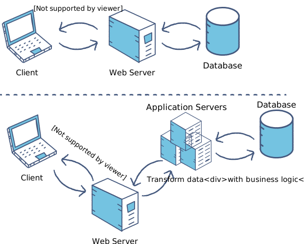

# MongooseShopping.js
A Very Simple Full Stack Shopping Cart

## Network Structure


## Project Purpose
This is a Personal Two Day Challenge to Learn More About AJAX, Asynchronous JavaScript, Database Managment With Mongoose, Routing, Front-End "Rendering" And CORS

## Back-End
* Live-Server (Web Server)
* Node.js, Express.js (Application Server and API)
* MongoDB with Mongoose ODM
## Front-End
* Vanilla JavaScript (AJAX with fetch())
* HTML and CSS
## How to Run
### Install And Start MongoDB Services
Installation Guide: [Here](https://docs.mongodb.com/manual/tutorial/install-mongodb-on-ubuntu/) and Start Service with ```sudo systemctl start mongod```

### Run Live Server as A Web Server On the Client Directory
```live-server MongooseShopping.js/client/ ```
### Run Node.js Dynamic Server as an Application Server
```cd MongooseShopping.js/``` 

Optional: Export a PORT with ```export PORT=8000```

```npm run devStart```

## [Issue] No Authentication
Authentication Will be Implemented On A Later Version
